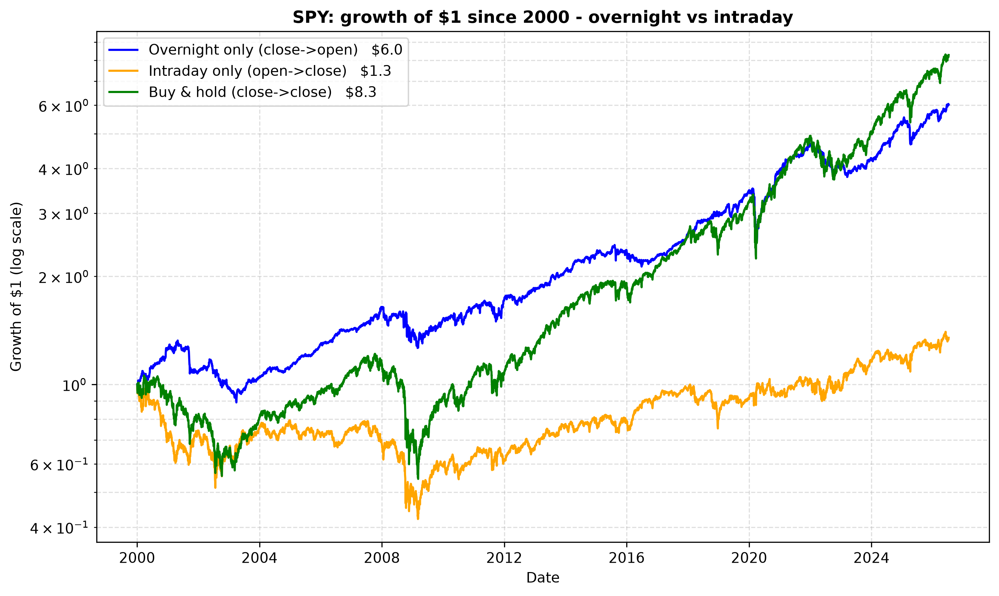
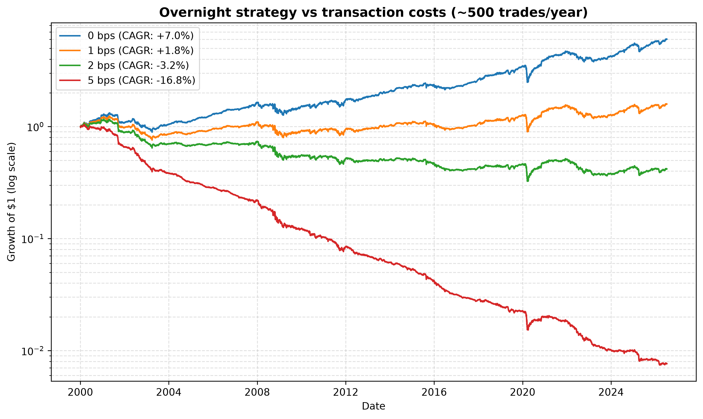
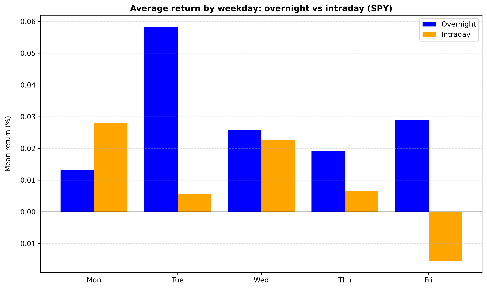
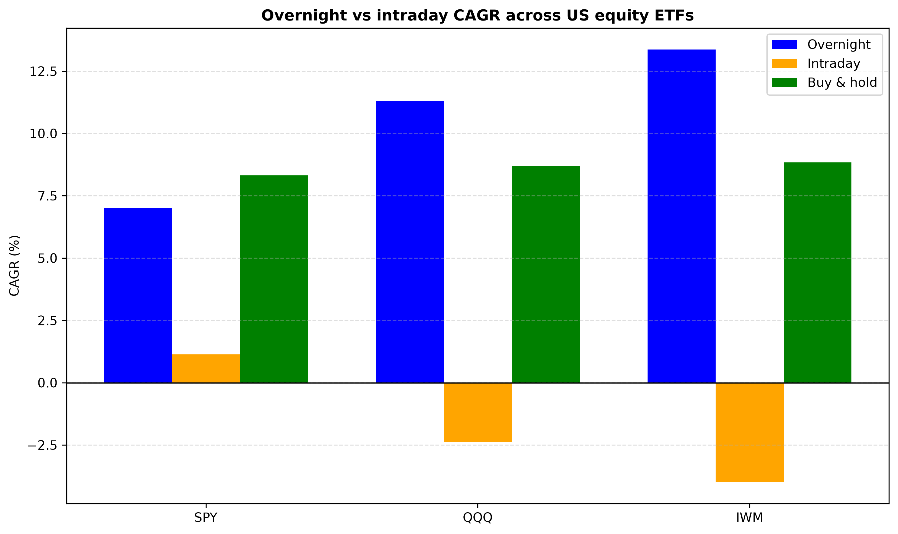

# Overnight vs Intraday: when does the US stock market earn its return?

A small, fully reproducible study that splits 26 years of US equity ETF returns
into two segments — **overnight** (yesterday's close → today's open, market
closed) and **intraday** (open → close, market open) — and asks which one earns
the return, whether it is statistically real, and whether it can be traded after
costs.

**One-line finding:** since 2000, essentially the entire close-to-close return of
SPY was earned **overnight**; for QQQ and IWM the intraday session actually *lost*
money over the full period. The effect is real but **not tradable after costs**.

**▶️ 5-minute video walkthrough:** https://www.loom.com/share/dbc0074c2c6e4da7833e0a394ed162c4

---

## Question

A buy-and-hold investor measures returns close-to-close. But that daily return is
the compound of two very different windows: the **overnight** window, when the
market is closed and most information arrives (earnings before the open, macro
data at 08:30, Asia/Europe trading while the US sleeps), and the **intraday**
session, the actual trading hours. *Which window earns the equity premium?* The
question has **zero free parameters**, so there is nothing to overfit.

## Data

- **SPY, QQQ, IWM** daily OHLC, 2000–2026, from Yahoo Finance via `yfinance`.
- `auto_adjust=True`: all four price columns are adjusted **consistently** for
  dividends and splits, so Open and Close stay comparable. This matters because
  the ex-dividend price drop lands at the open and would otherwise bias the
  overnight leg downward.
- Raw data is **committed as CSV** (`data/*.csv`); the notebook reads the CSV, not
  the live API, so results are reproducible.

## Method

For each day *t*:

| Leg | Formula |
|-----|---------|
| Overnight (Night) | `Open_t / Close_{t-1} − 1` |
| Intraday (Day)    | `Close_t / Open_t − 1` |
| Full day (Whole)  | `Close_t / Close_{t-1} − 1` |

The `shift(1)` on the previous close prevents look-ahead bias. The two legs
**compound** into the full day — `(1+Night)(1+Day) = (1+Whole)` — verified in the
notebook to ~1e-16 (floating-point exact). I then compute annualized return
(CAGR), annualized volatility (σ·√252), Sharpe (risk-free = 0), max drawdown, hit
rate, one-sample and paired t-tests, and a transaction-cost sweep.

## Results

**Growth of $1 in SPY, by leg (2000–2026):**



| Metric | Overnight | Intraday | Buy & hold |
|---|---|---|---|
| CAGR | **7.02%** | 1.14% | 8.32% |
| Ann. volatility | 11.20% | 15.50% | 19.30% |
| Sharpe (rf=0) | **0.66** | 0.15 | 0.51 |
| Max drawdown | −32.8% | −57.0% | −55.2% |
| $1 grew to | **$6.03** | $1.35 | $8.28 |

Almost all of SPY's return accrued overnight. The overnight leg beats buy-and-hold
on Sharpe (0.66 vs 0.51) at **half the drawdown**.

**Is it real?** A one-sample t-test says the overnight leg is significantly
positive (t = 3.41, p = 0.001); the intraday leg is not (t = 0.77, p = 0.44).
But a paired test of overnight *vs* intraday is **not** significant (t = 1.36,
p = 0.17): economically the gap is huge, statistically it is unproven —
**economically large ≠ statistically proven.**

**Can it be traded?** "Overnight only" needs ~500 trades/year. At a realistic
2 bps/trade it loses money:



| Cost/trade | $1 → | CAGR |
|---|---|---|
| 0 bps | $6.03 | +7.0% |
| 1 bps | $1.59 | +1.8% |
| 2 bps | **$0.42** | **−3.2%** |
| 5 bps | $0.01 | −16.8% |

**By weekday:** the overnight return is positive on every weekday (strongest
Tuesday), while the intraday session is weakest into the weekend (negative Friday).



**Cross-asset check (out-of-sample).** The pattern is a structural feature of US
equities, stronger in higher-beta names — for QQQ and IWM the intraday leg is
**negative** over 26 years:



| Ticker | Overnight CAGR | Intraday CAGR | Buy & hold | Overnight Sharpe |
|---|---|---|---|---|
| SPY | 7.02% | 1.14% | 8.32% | 0.66 |
| QQQ | 11.30% | **−2.39%** | 8.70% | 0.82 |
| IWM | 13.36% | **−3.98%** | 8.83% | 1.01 |

## Limitations

- yfinance's Open is the first print, not the official opening-auction price —
  this directly affects the overnight/intraday boundary.
- Daily returns are not i.i.d. (fat tails, volatility clustering), so t-test
  p-values are directional, not literal.
- Costs modeled as a flat constant; the risk-free rate is set to 0 in the Sharpe.
- Long-only, no shorting/leverage/taxes; ETFs only.

## What I'd do next

1. Replace yfinance opens with official opening-auction prices and re-test the boundary.
2. Build a market-neutral long-short overnight book to isolate the premium from beta.
3. Use block-bootstrap confidence intervals instead of the t-test (respect the fat tails).
4. Test whether the premium concentrates around scheduled events (earnings, FOMC, CPI).

## How I used AI tools

I used Claude Code as a quant mentor — statistics explanations, code review, and
independent control numbers to check my results against. I wrote and ran the
analysis myself and can derive every formula in the notebook by hand.

## Reproduce

```bash
python -m venv venv
venv\Scripts\activate        # Windows
pip install -r requirements.txt
python download_data.py      # downloads SPY, QQQ, IWM into data/
jupyter notebook analysis.ipynb   # then Run All
```

## Repository

```
analysis.ipynb    the full study (run top to bottom)
download_data.py  downloads SPY/QQQ/IWM with sanity checks
data/             committed raw CSVs
figures/          generated charts
DECISIONS.md      short log of the choices I made and why
requirements.txt
```
